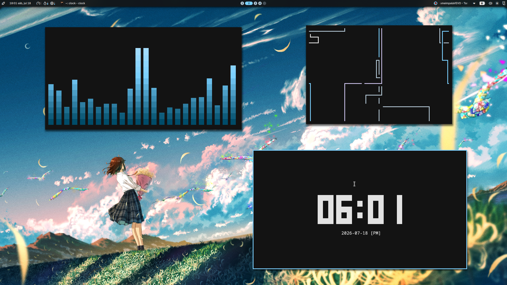
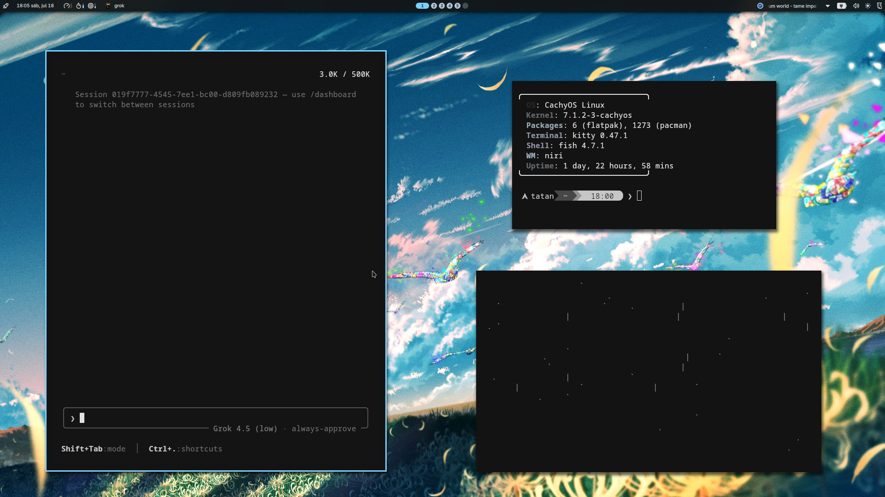
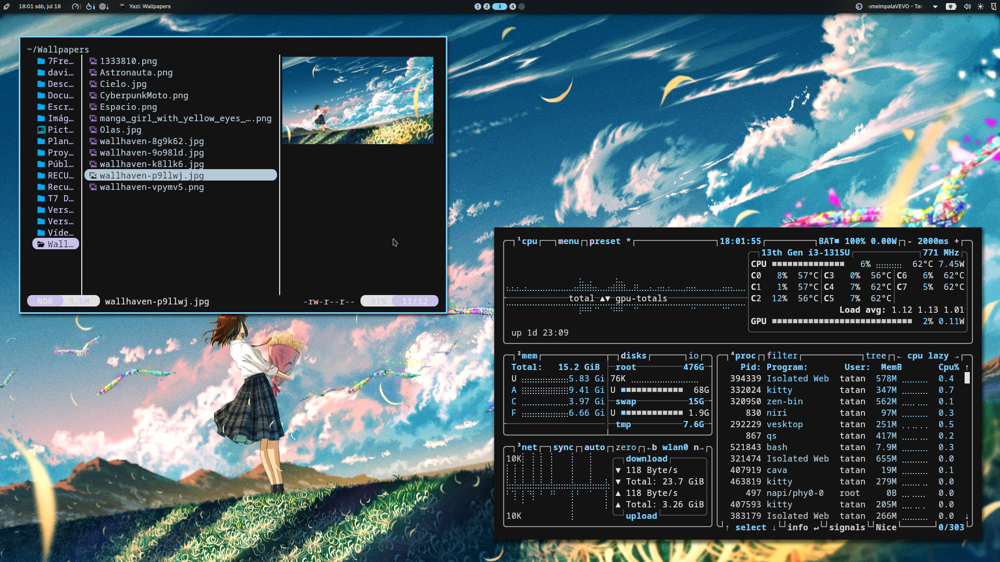
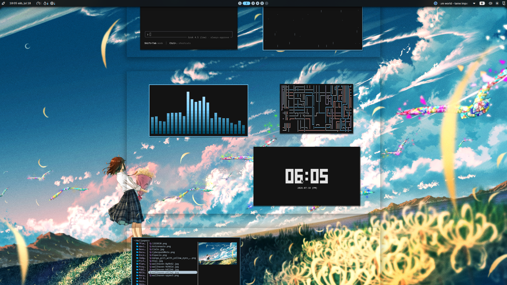
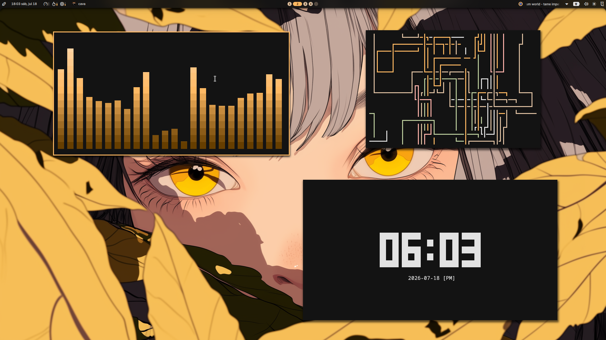
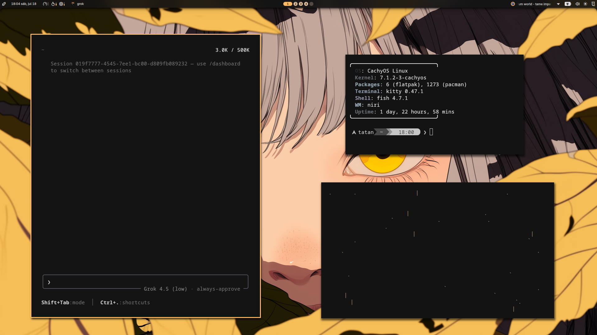
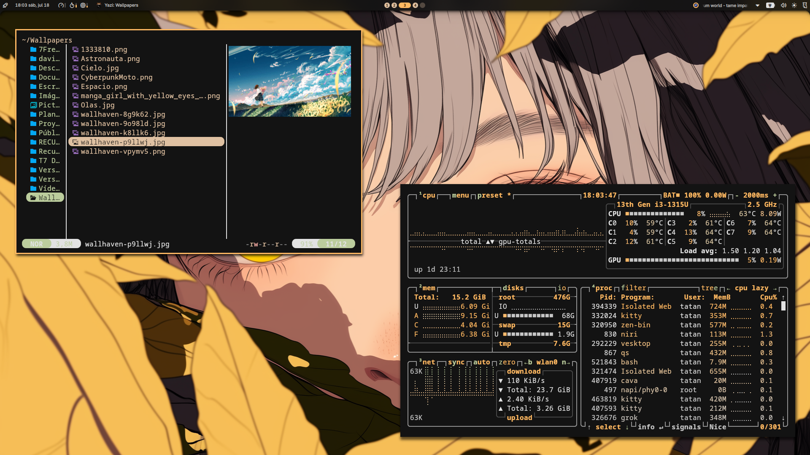
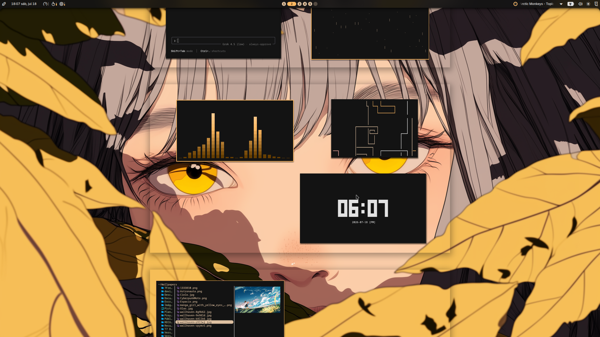

<div align="center">

# T7 Dotfiles **v3**

**Wallpaper-driven Material You** on [Hyprland](https://hyprland.org/) + [Noctalia Shell](https://github.com/noctalia-dev/noctalia-shell)

[**7Freeza**](https://github.com/7Freeza) · CachyOS · Kitty · Starship · Zen · Vesktop (system24) · Code - OSS

[](LICENSE)
[](https://hyprland.org/)
[](https://github.com/noctalia-dev/noctalia-shell)
[](#)

<br/>



</div>

---

## What’s new in v3

- **Primary stack: Hyprland 0.56 Lua** + Noctalia (was Niri in v2)
- Full **keybind map**, multi-monitor / lid via **`t7-display`**
- Dual keyboard policy (laptop **latam** + Redragon K630 custom XKB)
- Screenshots (`t7-screenshot`), wallpaper cycle, system24 Discord
- Installer skips secrets (no Vesktop session, no tokens, `@@HOME@@` expand)
- **New rice gallery** under `screenshots/` (replaces v2 images)

Niri configs remain under `config/niri/` as **legacy / optional** (`DOTFILES_NIRI=1`).

---

## Features

- **Live Material You** from wallpaper via Noctalia
- **Desktop in sync** — bar, Kitty, Starship, Hypr borders, Zen hooks, Vesktop **system24**, VS Code, btop, cava, fastfetch
- **Wallpaper cycle** — `Super+Shift+W` recolors the rice
- Subtle rounded corners, snappy window anims
- **Clamshell + HDMI** policy daemon (`t7-display.service`)
- `install.sh` + `wallpapers/` for install

---

## Gallery

### Cool palette

| | |
|:---:|:---:|
|  |  |
|  |  |

### Warm palette

| | |
|:---:|:---:|
|  |  |
|  |  |

---

## Quick start

> [!NOTE]
> Install **Hyprland (≥ 0.56)**, **Noctalia Shell / qs**, and deps first.  
> See [docs/dependencies.md](docs/dependencies.md).

```bash
git clone https://github.com/7Freeza/T7-Dotfiles.git ~/T7-Dotfiles
cd ~/T7-Dotfiles
./install.sh
```

Then:

```bash
systemctl --user enable --now t7-display.service   # multi-monitor / lid
qs -c noctalia-shell &
```

Pick a wallpaper once so colors generate. In Vesktop, enable the **system24** theme.

| Variable | Default | Effect |
|----------|---------|--------|
| `DOTFILES_LINK=0` | `1` (symlink where safe) | Copy files instead |
| `DOTFILES_WALLPAPERS=0` | `1` | Skip wallpaper install |
| `DOTFILES_NIRI=1` | `0` | Also install legacy Niri configs |

---

## Keybinds (highlights)

| Key | Action |
|-----|--------|
| `Super+Space` | Launcher |
| `Super+Q` | Kitty |
| `Super+W` | Zen Browser |
| `Super+E` | Files |
| `Super+V` | Toggle floating |
| `Super+T` | Toggle group |
| `Super+ñ` / `Super+{` | Shrink / grow width |
| `Super+Shift+W` | Next wallpaper |
| `Super+Shift+I` | Wallpaper selector |
| `Ctrl+Shift+1` | Region screenshot |

**Full table:** [docs/KEYBINDS.md](docs/KEYBINDS.md)  
**Source:** [`config/hypr/hyprland.lua`](config/hypr/hyprland.lua)

---

## Layout of this repo

```text
config/
  hypr/           # hyprland.lua + conf + noctalia colors
  noctalia/       # settings (@@HOME@@), templates, discord.css
  vesktop/        # system24.theme.css only (+ minimal settings.json)
  t7/             # display policy
  xkb/            # Redragon K630 maps
  systemd/user/   # t7-display.service
  kitty fish …    # aesthetic stack
  niri/           # legacy optional
scripts/          # t7-display, screenshot, keyboard, wallpaper, zen…
wallpapers/       # shipped walls → ~/Wallpapers (install)
screenshots/      # README gallery (rice photos)
docs/             # dependencies, KEYBINDS
install.sh
```

---

## Security / clean install

- No Vesktop `sessionData`, cookies, or Discord tokens  
- No browser profiles / password DBs  
- No API keys  
- Paths use `@@HOME@@` and expand at install time  
- Machine-specific monitors via `t7-display` + `~/.config/t7/display.conf`

Never commit raw browser profiles or Discord session folders.

---

## Discord system24

- Theme: [`config/vesktop/themes/system24.theme.css`](config/vesktop/themes/system24.theme.css)
- Noctalia template: [`config/noctalia/templates/discord.css`](config/noctalia/templates/discord.css)

Enable the theme inside Vesktop after install.

---

## Multi-monitor & lid

```bash
t7-display status
t7-display ensure
systemctl --user enable --now t7-display.service
```

Policy: `~/.config/t7/display.conf` (defaults eDP-1 / HDMI-A-1).

---

## License

MIT — see [LICENSE](LICENSE).

---

<div align="center">

Built for daily driving · **v3 · Hyprland + Noctalia**

</div>
