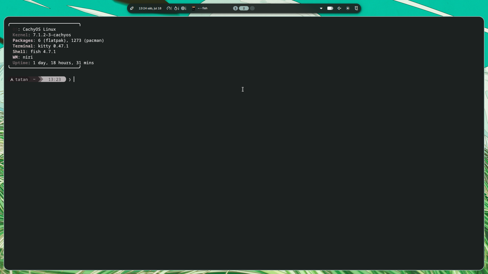
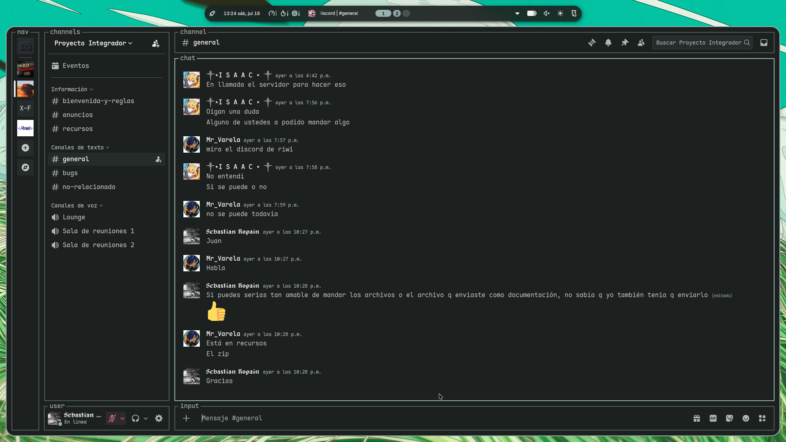
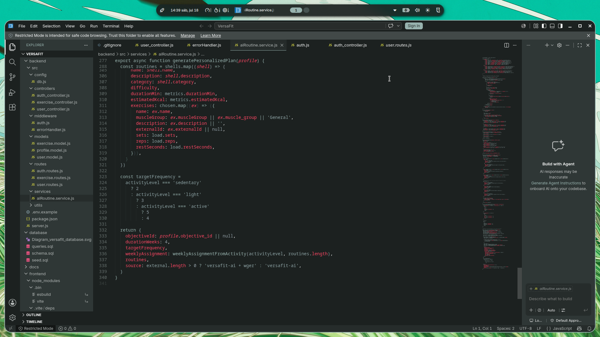
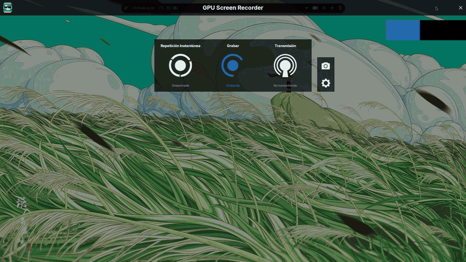

<div align="center">

# T7 Dotfiles

**Wallpaper-driven Material You rice** on [Niri](https://github.com/YaLTeR/niri) + [Noctalia Shell](https://github.com/noctalia-dev/noctalia-shell)

Maintained by [**7Freeza**](https://github.com/7Freeza)

`CachyOS` · `Niri` · `Noctalia` · `Kitty` · `Starship` · `Zen` · `Vesktop` · `Code - OSS`

[](LICENSE)
[](https://github.com/YaLTeR/niri)
[](https://github.com/noctalia-dev/noctalia-shell)

<br/>


</div>

---

## Features

- **Live colors from wallpapers** — Material You (`muted`) via Noctalia; almost everything recolors together
- **Synced apps** — Kitty, Starship, fastfetch, Niri borders, Zen Browser, Vesktop (system24), VS Code / Code - OSS, btop, cava
- **Wallpaper transitions** — animated disc/wipe transitions + one-key cycle
- **Clean Zen CSS chain** — no double imports after theme regeneration
- **Starship powerline** — CachyOS icon + palette locked to the wallpaper
- **Niri column stack / tabs** — `Super+V` / `Super+B` (Hyprland-like grouping)
- **Shipped wallpapers** — ready to use after install

---

## Gallery

| Desktop | Terminal |
|:-------:|:--------:|
|  |  |
| **Vesktop** | **VS Code** |
|  |  |

### Wallpaper cycle (colors follow)

<div align="center">
  
</div>

> Press **`Super+Shift+W`** to advance wallpapers. **`Super+Shift+I`** opens the selector.

---

## Quick start

> [!NOTE]
> Install **Niri**, **Noctalia Shell**, and dependencies first.  
> See [docs/dependencies.md](docs/dependencies.md).

```bash
git clone https://github.com/7Freeza/T7-Dotfiles.git ~/T7-Dotfiles
cd ~/T7-Dotfiles
./install.sh
```

Then log out/in (or restart niri + noctalia-shell) and **pick a wallpaper once** so colors generate.

### Install options

| Env var | Default | Effect |
|---------|---------|--------|
| `DOTFILES_LINK=1` | `1` | Symlink config trees (good for tracking changes) |
| `DOTFILES_LINK=0` | — | Copy files instead |
| `DOTFILES_WALLPAPERS=0` | `1` | Skip copying wallpapers |

```bash
DOTFILES_LINK=0 ./install.sh
```

Existing configs are backed up under `~/.config/t7-dotfiles-backup-<timestamp>/`.

---

## Color pipeline

```text
wallpaper change
      ↓
Noctalia Material You (muted)
      ↓
built-in templates → Kitty · Niri · Starship · Zen · btop · cava
user templates     → Vesktop (system24) · fastfetch · aesthetic.env · VS Code
      ↓
hook → fix-zen-noctalia-theme  (clean userChrome import chain)
```

Templates live in `config/noctalia/templates/`.  
Paths use `@@HOME@@` and are expanded by `install.sh`.

---

## Keybinds (Mod = Super)

| Key | Action |
|-----|--------|
| `Super+Space` | Launcher |
| `Super+Q` | Kitty |
| `Super+W` | Zen Browser |
| `Super+E` | File manager |
| `Super+Shift+W` | Next wallpaper |
| `Super+Shift+I` | Wallpaper selector |
| `Super+Shift+Q` | Session menu |
| `Super+Alt+L` | Lock screen |
| `Super+V` | Stack window into column |
| `Super+B` | Toggle column tabs |
| `Super+O` | Overview |
| `Super+C` | Close window |

Full map: `config/niri/cfg/keybinds.kdl`.

---

## Structure

```text
T7-Dotfiles/
├── config/
│   ├── niri/           # compositor + keybinds
│   ├── noctalia/       # shell settings + color templates
│   ├── kitty/          # terminal
│   ├── fish/           # shell + aesthetic toys
│   ├── starship.toml
│   ├── vesktop/        # theme only (no session data)
│   ├── code-oss/       # editor theme
│   ├── zen/chrome/     # CSS import chain
│   ├── btop/  cava/  fastfetch/  gtk-3.0/
│   └── aesthetic/
├── scripts/            # next-wallpaper · fix-zen · zen-browser
├── wallpapers/
├── screenshots/
├── docs/
├── install.sh
└── LICENSE
```

Details: [docs/structure.md](docs/structure.md).

---

## Post-install checklist

1. Dependencies from [docs/dependencies.md](docs/dependencies.md)
2. Restart **niri** + **noctalia-shell**
3. Set a wallpaper in Noctalia (generates live colors)
4. **Vesktop** → Themes → enable **system24**
5. **Code - OSS / VS Code** → install Noctalia theme extension → theme `NoctaliaTheme`
6. Optional fonts: **Maple Mono** (Discord), **capitaine-cursors**

---

## Privacy

This repo ships **aesthetic configs only**:

- no Discord/Vesktop tokens or session data  
- no browser passwords, cookies, or profiles  
- no personal paths (portable `@@HOME@@` tokens)  
- no telemetry secrets  

---

## Credits

- [Niri](https://github.com/YaLTeR/niri) — scrollable tiling compositor  
- [Noctalia Shell](https://github.com/noctalia-dev/noctalia-shell) — bar, theming, wallpaper IPC  
- [system24](https://github.com/refact0r/system24) by refact0r — Vesktop theme base  
- Wallpapers included for convenience; respect original artists’ rights if you redistribute

---

## License

[MIT](LICENSE) — configs and scripts. Media in `wallpapers/` may have separate rights.
